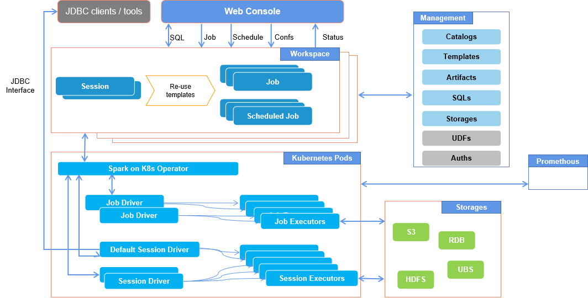

### 关于 Bytenative Spark Operator



**特性**
- 基于 Google's Spark on K8S Operator，构建云原生的 Spark 运行环境
- 用户友好的模型定义，支持
    - 重新根据场景划分Spark Job、Session和ScheduledJob
    - 增加Catalog、S3Connection、Jdbc Datasource的配置，以及资源预定义
    - 支持Spark配置模板重用，避免每次使用需要重新配置，从开发到生产任务执行快速部署. 根据不同应用覆写模板配置.

- Session 模式。数据开发或者分析人员可以通过各种JDBC或者支持HiveServer2的工具连接到Session，交互式执行SQL
- 支持在任务中直接定义SQL，或者配置SQL文件，面向数据开发人员

- 结合 Web Console，支持
    - 多租户，以及用户管理
    - 工作空间 (Workspace) 管理
    - SQL Editor 和文件管理
    - 物件管理。 包括Jars、Files、SQL Scripts等
    - 满足开箱即用的生产环境支持

### Build Docker images
Images 也可从 hub.docker.com 获得。请参考 [values-s3-docker-io.yam](./deploy/values-s3-docker-io.yaml) 通过 helm 进行安装.
- bekingcn/spark:v3.4.1
- bekingcn/spark-operator:v1-0.1.0-3.4.1
- bekingcn/bn-spark-operator:v1-0.1.0-3.4.1

#### 1. Spark Image
本 image 与官方有些差异，主要是添加了额外的jar，以及支持更多的Spark版本

```SH
docker build -f Dockerfile-spark-3.4.1 -t bnp.me/bn-spark-operator/spark:v3.4.1 .
```

#### 2. Google's Spark Operator
本 image 基于官方进行更改以支持新功能和新的 Spark 版本，必须使用我们的脚本重新构建。官方 image 仅支持Spark 3.1.1作为最新版本。

```SH
docker build -f spark-operator/Dockerfile-sko-spark-template -t bnp.me/bn-spark-operator/spark-operator:v1-0.1.0-3.4.1 --build-arg VERSION=3.4.1 --build-arg REGISTRY=bnp.me/ .
```

#### 3. Bytenative Spark Operator

```SH
docker build -f Dockerfile -t bnp.me/bn-spark-operator/bn-spark-operator:v1-0.1.0-3.4.1 .
```

### Installing Kubernetes using K3s

K3s 提供了一种安装 Kubernetes 的快速方法。在你的节点上运行以下命令以安装 K3s：

```bash
curl -sfL https://get.k3s.io | sh -s - --write-kubeconfig-mode 644

# or disable traefik
curl -sfL https://get.k3s.io | sh -s - --write-kubeconfig-mode 644 --disable traefik
```

如果要在应用程序中将 S3 连接与密钥一起使用，则必须在安装版本时对其进行配置。

首先，在 Spark 运算符命名空间中添加 S3 凭据（如果不存在，则为 Spark Operator 创建一个新命名空间）

```bash
mkdir ~/.kube
ln -s /etc/rancher/k3s/k3s.yaml ~/.kube/config
```

### Use Helm to deploy 
```SH
# create a namespace for spark operators
kubectl create namespace spark-operator
# create a namespace for your spark jobs, or use the same nameapsce with spark operators as default.
kubectl create namespace sparkjobs

helm upgrade spark-runner deploy/helm/spark-operator -i --namespace spark-operator --create-namespace --set logLevel=3 --set sparkJobNamespace=sparkjobs

```

#### Use S3 as repository with Secret

If to use S3 connection with a Secret in applications, you have to config it when installing your release.

First, Add a S3 credentials in the Spark operator namespace (create a new namespace for Spark operator if not existing)

```SH
kubectl create secret generic s3-connection --from-literal=accessKey=minio --from-literal=secretKey=miniopass -n spark-operator
```

然后配置一个 values.yaml 用于安装 helm release
```YAML
env:
- name: AWS_ACCESS_KEY_ID
  valueFrom:
    secretKeyRef:
      name: s3-connection
      key: accessKey
- name: AWS_SECRET_ACCESS_KEY
  valueFrom:
    secretKeyRef:
      name: s3-connection
      key: secretKey
```

使用 values.yaml 运行 helm

```SH
helm upgrade spark-runner deploy/helm/spark-operator -i --namespace spark-operator --create-namespace --set logLevel=3 --set sparkJobNamespace=sparkjobs -f values-spark-3.4.1.yaml
```

#### Uninstall helm release

```SH
helm uninstall spark-runner --namespace spark-operator
```

### Run your Spark applications

**A simple job example as pi-job.yaml**

```YAML
# pi-job.yaml

apiVersion: spark.bytenative.com/v1
kind: SparkJob
metadata:
  name: pi-job-example-341
  namespace: sparkjobs
spec:
  spark:
    sparkVersion: "3.4.1"
    mode: cluster
    imagePullPolicy: IfNotPresent
    image: bnp.me/bn-spark-operator/spark:v3.4.1
    restartPolicy:
      type: Never
    driver:
      serviceAccount: spark-runner-spark
  job:
    type: JarJob
    jar:
      mainApplicationFile: "local:///opt/spark/examples/jars/spark-examples_2.12-3.4.1.jar"
      mainClass: org.apache.spark.examples.SparkPi

```

**[More examples](./examples)**


### 对 Spark 版本的支持

  | Spark Operator  | Spark Job         | Spark Session     |
  | --              | --                | --                |
  | 3.1.1           | all               | all               | 
  | 3.1.1-hadoop3   | all               | all               |  
  | 3.1.3           | all               | all               |  
  | 3.2.4           | all               | all               |  
  | 3.2.4-hadoop3   | all               | all               |  
  | 3.3.3           | all               | all               |  
  | 3.4.1           | all               | all               |

