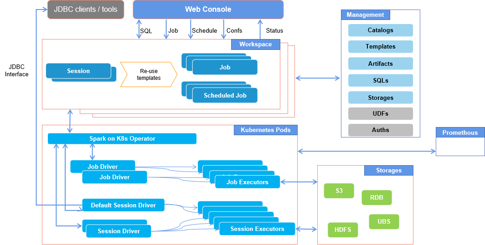

### What's Bytenative Spark Operator



**Features**

- Based on Google's Spark on K8S Operator, build a cloud-native Spark operating environment.
- User-friendly model definition, supporting:
  - Reorganizing Spark Jobs, Sessions, and Scheduled Jobs based on different scenarios.
  - Adding configurations for Catalog, S3Connection, Jdbc Datasource, and pre-defined resources.
  - Supporting Spark configuration template reusability, avoiding the need for reconfiguration every time and enabling quick deployment from development to production tasks. Template configurations can be overridden based on different applications.
- Session mode. Data developers or analysts can connect to sessions through various JDBCs or HiveServer2-compatible tools for interactive SQL execution.
- Supporting direct SQL definition within tasks or configuration of SQL files, targeting data developers.
- With the Web Console, support
  - Multi-tenancy and user management.
  - Workspace management.
  - SQL Editor and file management.
  - Artifacts management. Including Jars, Files, SQL Scripts, etc.
  - Providing out-of-the-box support for production environments.

### Build Docker images
These images are availiable from hub.docker.com. Please reference [values-s3-docker-io.yam](./deploy/values-s3-docker-io.yaml) for helm installation.
- bekingcn/spark:v3.4.1
- bekingcn/spark-operator:v1-0.1.0-3.4.1
- bekingcn/bn-spark-operator:v1-0.1.0-3.4.1

#### 1. Spark Image
This image follow the official script, but jars were added for the new feature. 

```SH
docker build -f Dockerfile-spark-3.4.1 -t bnp.me/bn-spark-operator/spark:v3.4.1 .
```

#### 2. Google's Spark Operator
This image was changed to support new features and new Spark versions, has to be re-build with our scripts. The official image only support Spark 3.1.1 as the latest version.

```SH
docker build -f spark-operator/Dockerfile-sko-spark-template -t bnp.me/bn-spark-operator/spark-operator:v1-0.1.0-3.4.1 --build-arg VERSION=3.4.1 --build-arg REGISTRY=bnp.me/ .
```

#### 3. Bytenative Spark Operator

```SH
docker build -f Dockerfile -t bnp.me/bn-spark-operator/bn-spark-operator:v1-0.1.0-3.4.1 .
```

### Installing Kubernetes using K3s

K3s provides a quick way of installing Kubernetes. On your control node run the following command to install K3s:

```bash
curl -sfL https://get.k3s.io | sh -s - --write-kubeconfig-mode 644

# or disable traefik
curl -sfL https://get.k3s.io | sh -s - --write-kubeconfig-mode 644 --disable traefik
```

So long as you have an Internet connection K3s will download and automatically configure a simple Kubernetes environment.

Create a symlink to the Kubernetes configuration from your home directory to allow tools like Helm to find the correct configuration.

```bash
mkdir ~/.kube
ln -s /etc/rancher/k3s/k3s.yaml ~/.kube/config
```

### Use Helm to deploy 
```SH
# create a namespace for spark operators
kubectl create namespace spark-operator
# create a namespace for your spark jobs, or use the same nameapsce with spark operators as default.
kubectl create namespace sparkjobs

helm upgrade spark-runner deploy/helm/spark-operator -i --namespace spark-operator --create-namespace --set logLevel=3 --set sparkJobNamespace=sparkjobs

```

#### Use S3 as repository with Secret

If to use S3 connection with a Secret in applications, you have to config it when installing your release.

First, Add a S3 credentials in the Spark operator namespace (create a new namespace for Spark operator if not existing)

```SH
kubectl create secret generic s3-connection --from-literal=accessKey=minio --from-literal=secretKey=miniopass -n spark-operator
```

And then config a values.yaml for installing release.
```YAML
env:
- name: AWS_ACCESS_KEY_ID
  valueFrom:
    secretKeyRef:
      name: s3-connection
      key: accessKey
- name: AWS_SECRET_ACCESS_KEY
  valueFrom:
    secretKeyRef:
      name: s3-connection
      key: secretKey
```

Run helm with the values.yaml

```SH
helm upgrade spark-runner deploy/helm/spark-operator -i --namespace spark-operator --create-namespace --set logLevel=3 --set sparkJobNamespace=sparkjobs -f values-spark-3.4.1.yaml
```

#### Uninstall helm release

```SH
helm uninstall spark-runner --namespace spark-operator
```

### Run your Spark applications

**A simple job example as pi-job.yaml**

```YAML
# pi-job.yaml

apiVersion: spark.bytenative.com/v1
kind: SparkJob
metadata:
  name: pi-job-example-341
  namespace: sparkjobs
spec:
  spark:
    sparkVersion: "3.4.1"
    mode: cluster
    imagePullPolicy: IfNotPresent
    image: bnp.me/bn-spark-operator/spark:v3.4.1
    restartPolicy:
      type: Never
    driver:
      serviceAccount: spark-runner-spark
  job:
    type: JarJob
    jar:
      mainApplicationFile: "local:///opt/spark/examples/jars/spark-examples_2.12-3.4.1.jar"
      mainClass: org.apache.spark.examples.SparkPi

```

**[More examples](./examples)**


### Supports on Spark versions

  | Spark Operator  | Spark Job         | Spark Session     |
  | --              | --                | --                |
  | 3.1.1           | all               | all               | 
  | 3.1.1-hadoop3   | all               | all               |  
  | 3.1.3           | all               | all               |  
  | 3.2.4           | all               | all               |  
  | 3.2.4-hadoop3   | all               | all               |  
  | 3.3.3           | all               | all               |  
  | 3.4.1           | all               | all               |

### Road mapping
TODO
